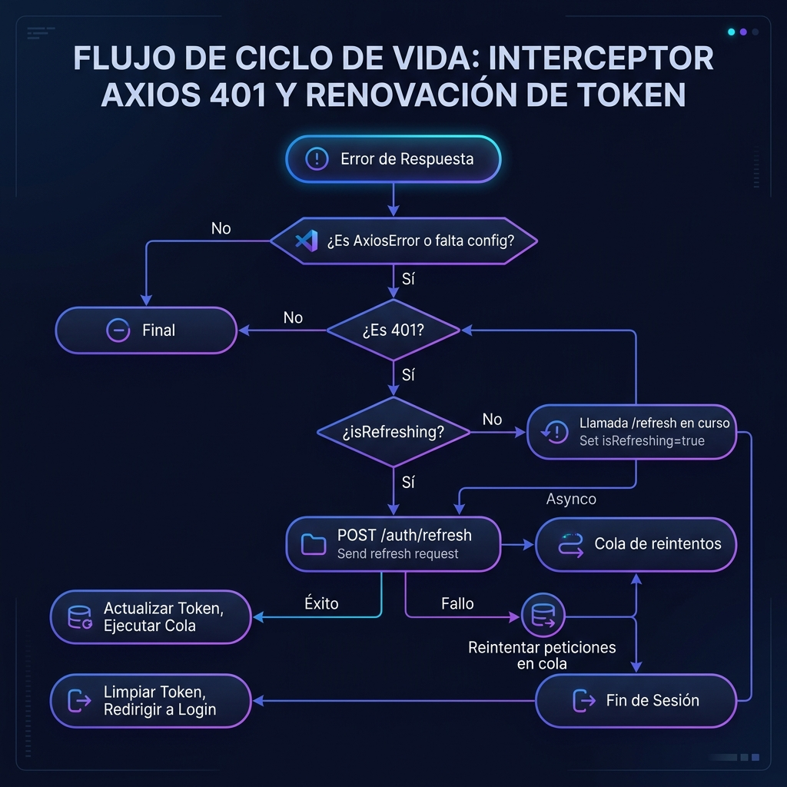
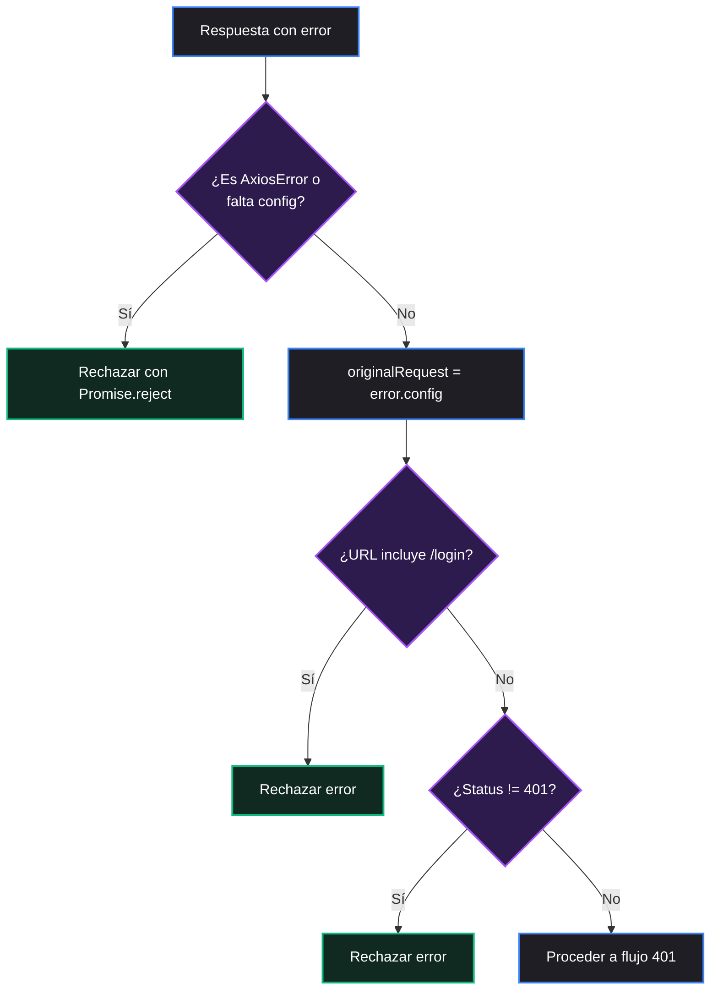
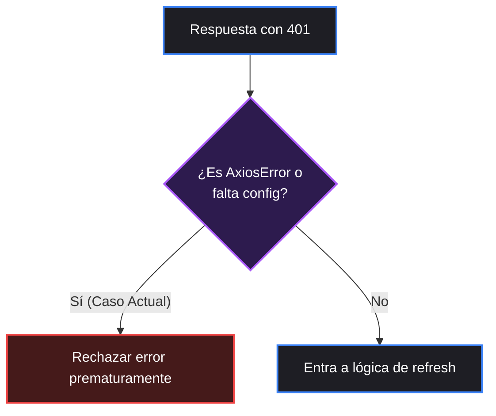

# 🔄 Flujo del Interceptor Axios (401 y no 401)

Este documento detalla el comportamiento técnico y el flujo de control del interceptor de peticiones y respuestas HTTP implementado en el cliente de la aplicación.

### 📂 Archivos Involucrados
- **Interceptor:** `src/shared/interceptors/axios.interceptor.ts`
- **Cliente Axios:** `src/shared/api/axios.ts`

---

## ⚡ Contexto de Inicialización

El cliente Axios centralizado se define en `src/shared/api/axios.ts` como la constante `api`, donde se configuran los interceptores globales:

```ts
setUpAxiosInterceptors(api);
```

Esto garantiza que **todas** las peticiones salientes y respuestas entrantes gestionadas a través del cliente `api` sean procesadas por este interceptor de manera automática.

---

## 🗺️ Diagrama de Flujo Visual (Esperado)

A continuación se muestra el diagrama visual de alta fidelidad que ilustra el ciclo completo de interceptación ante respuestas de error, especialmente enfocado en la detección del código `401 Unauthorized` y el proceso de refresco del token de sesión.



---

## 1️⃣ Flujo cuando la respuesta NO es un error 401

### ⚙️ Comportamiento
Si la petición falla pero el código de estado HTTP es diferente a `401 Unauthorized`, el interceptor captura la excepción e inmediatamente propaga el error rechazando la promesa.



---

## 2️⃣ Flujo cuando la respuesta SÍ es un error 401

### ⚠️ 2.1 Flujo Real Actual (Problema detectado)

Actualmente, existe una cláusula de guarda al inicio del bloque de captura de errores (`catch`):

```ts
if (axios.isAxiosError(error) || !error.config) {
  return Promise.reject(error);
}
```

**Consecuencia práctica:** Debido a que la mayoría de los errores HTTP devueltos por Axios son instancias de `AxiosError`, esta condición se evalúa como verdadera inmediatamente. Como resultado, el flujo se interrumpe prematuramente rechazando el error `401` y **nunca** se ejecuta la lógica de renovación de token (Token Refresh).



---

### 🚀 2.2 Flujo Esperado (Solución propuesta)

Al corregir la condición inicial permitiendo que los `AxiosError` válidos con su configuración intacta continúen en el interceptor, se activa el mecanismo de recuperación y refresco asíncrono:

```mermaid
flowchart TD
    classDef default fill:#1e1e24,stroke:#3b82f6,stroke-width:2px,color:#fff;
    classDef decision fill:#2d1b4e,stroke:#a855f7,stroke-width:2px,color:#fff;
    classDef action fill:#112a21,stroke:#10b981,stroke-width:2px,color:#fff;
    classDef danger fill:#451a1a,stroke:#ef4444,stroke-width:2px,color:#fff;

    A[Error de respuesta] --> B{"¿No es AxiosError o<br>no hay config?"}:::decision
    B -- Sí --> C[Rechazar error]:::danger
    B -- No --> D[originalRequest = error.config]

    D --> E{"¿URL incluye /login?"}:::decision
    E -- Sí --> F[Rechazar error]:::danger
    E -- No --> G{"¿Status es 401?"}:::decision
    G -- No --> H[Rechazar error]:::danger
    G -- Sí --> I{"¿originalRequest._retry<br>ya es true?"}:::decision

    I -- Sí --> J[Rechazar error (Bucle)]:::danger
    I -- No --> K{"¿isRefreshing es true?"}:::decision

    K -- Sí --> L[Encolar request en failedQueue]:::action
    L --> M[Esperar token nuevo y reintentar]

    K -- No --> N[Marcar _retry = true e isRefreshing = true]:::action
    N --> O[POST /api/auth/refresh]:::action
    O --> P{"¿Refresh exitoso?"}:::decision

    P -- Sí --> Q[TokenManager.setAccessToken]:::action
    Q --> R[processQueue(null, newAccessToken)]:::action
    R --> S[Setear Authorization en cabecera]:::action
    S --> T[Reintentar axiosClient(originalRequest)]:::action

    P -- No --> U[processQueue(error)]:::danger
    U --> V[TokenManager.removeAccessToken]:::danger
    V --> W[Redirigir a /login]:::danger
    W --> X[Rechazar error original]:::danger
```

---

## 📌 Notas Clave del Diseño

- ⏳ **Cola de Peticiones (`failedQueue`):** Cuando múltiples peticiones concurrentes fallan con `401` simultáneamente, solo la primera inicia el proceso de renovación del token (`isRefreshing = true`). Las demás peticiones se encolan para evitar múltiples llamadas concurrentes al endpoint `/refresh`.
- 🔑 **Gestión de Sesión:** Si la renovación del token de refresco falla (`401` en el propio endpoint de refresh), se limpian todas las credenciales activas del almacenamiento local y se fuerza una redirección al inicio de sesión para mantener el estado seguro de la aplicación.
